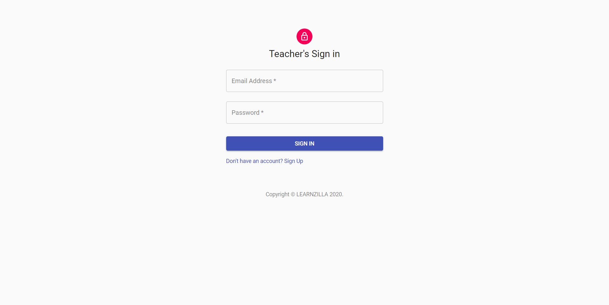
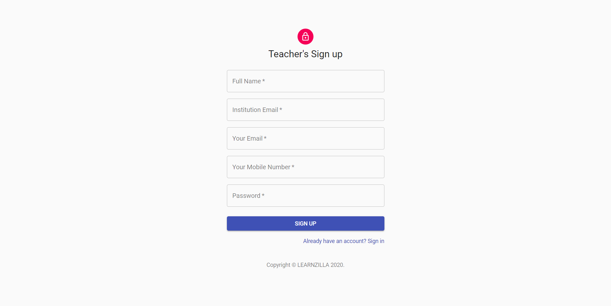
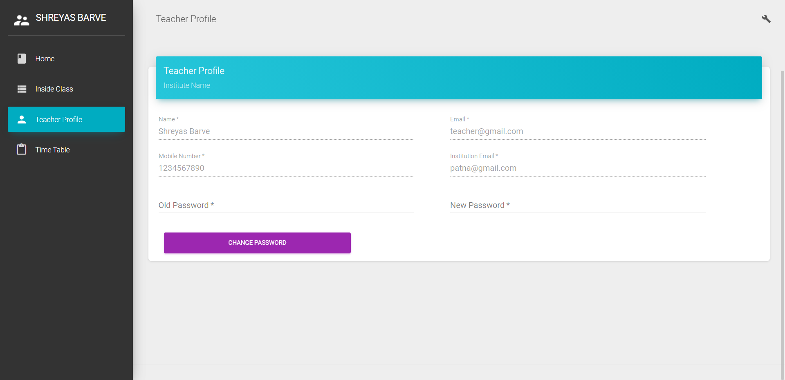
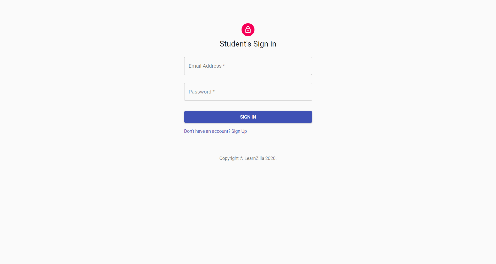
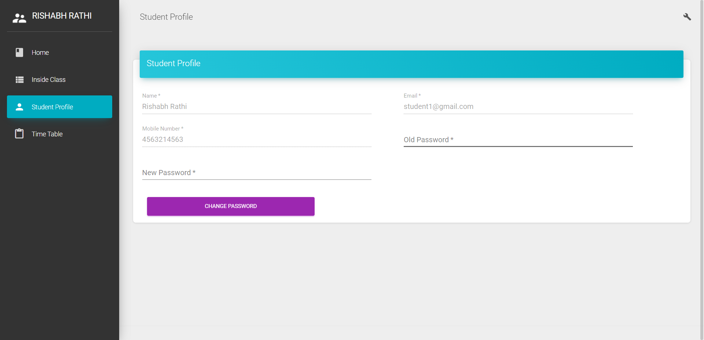
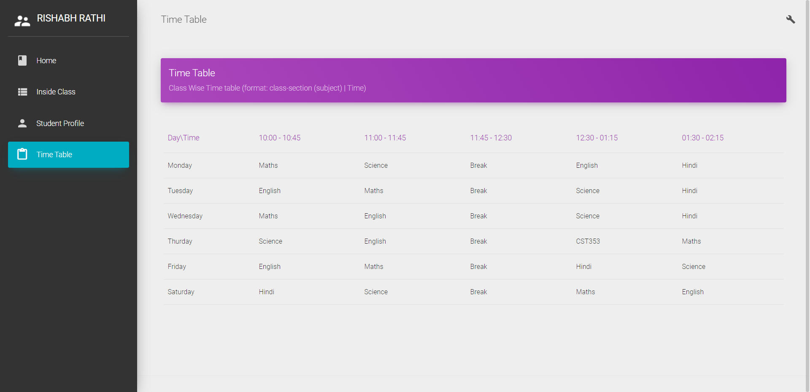

## [App Live here](https://mainpageempower.netlify.app/)

## [Live Demo Video](https://youtu.be/T7amNQxGk4E)

###

## Quick Start

Quick start option:

- Extract the zip file.
- Navigate inside the folder.
- `npm i material-dashboard-react`

###

## Run this if you face any issues:

- Run the following in command line or powershell:
- `npm cache clean --force `
- Navigate inside the folder.
- `npm install`
- `npm start`

###

## Technology Stacks:

     

###

## Demo

# Main Page

# Full Page

# Login Options

###

# [Teacher Dashboard](https://learnzilla-teacher.netlify.app/)

# Signin Page

# Signup Page

# Home page

# Inside Class

# Profile Page

# Time Table Page

# Email Sender 

# Live Chat Feature using Socket.io and Nodejs

###

# [Student Dashboard](https://learnzilla-student.netlify.app/)

# Signin Page

# Signup Page

# Home Page

# Inside Class

# Profile Page

# Time Table Page

## Team Members
   
